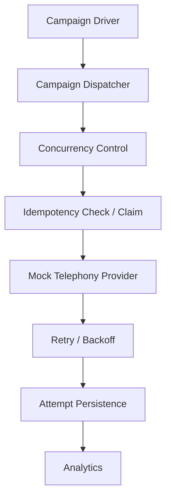
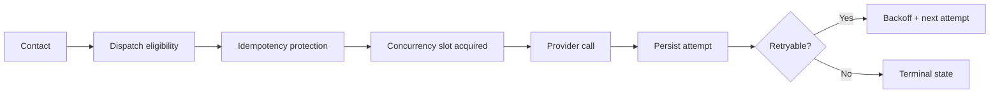

# 🚀 Outbound Voice Campaign Dispatcher

Synthetic outbound campaign orchestration in Python using `asyncio`, SQLite, and a deterministic mock telephony layer.

   

This project implements a small but testable outbound call dispatcher that schedules a synthetic campaign, enforces a configured concurrency cap, persists every actual attempt, retries retryable outcomes with backoff, and computes analytics from durable records. The design is intentionally narrow and local: it demonstrates orchestration correctness, deduplication, retry semantics, and analytics in a way that is easy to reason about and validate.

## What this demonstrates

- bounded concurrency
- concurrent idempotency
- controlled retries
- durable attempt records
- campaign analytics
- deterministic testing

## Architecture



The runtime flow is straightforward:

1. The CLI builds a synthetic contact cohort.
2. The dispatcher places each contact into an async queue.
3. A bounded number of workers pull jobs from the queue.
4. Before dispatching, the code reserves the per-attempt record to ensure idempotency.
5. The mock telephony layer returns a synthetic disposition and latency.
6. The result is written to SQLite.
7. Retryable states are retried with backoff.
8. Analytics are calculated from the persisted attempt rows.

## Core Guarantees

| Guarantee | Implementation | What it ensures |
|---|---|---|
| Concurrency | `max_in_flight` workers + `asyncio.Queue` | No more than the configured number of provider calls are active at once |
| Idempotency | unique `(campaign_id, contact_id, attempt_no)` reservation in SQLite | Duplicate requests for the same logical attempt do not create duplicate provider calls |
| Retry | `should_retry()` with `next_backoff_delay()` | Only `no_answer` and `failed` outcomes are retried |
| Persistence | `call_attempts` table writes | Every actual provider attempt is stored with disposition, timestamp, and latency |
| Analytics | `compute_analytics()` over persisted rows | Metrics are derived from recorded data rather than transient in-memory state |

## Dispatch Lifecycle



The dispatcher uses a queue-driven worker model: jobs are queued first, then only a limited number of workers are allowed to call the provider at once. A reservation is written before the dispatch executes so a duplicate request can immediately detect that the logical attempt has already been claimed.

## Concurrency

The project enforces a configurable concurrency cap via the CLI flag `--concurrency` and the `CampaignDispatcher(max_in_flight=...)` setting.

For example, with `--concurrency 10`:

- at most 10 provider calls may be active at the same time
- additional contacts remain queued until a worker slot is available
- `asyncio` is used to coordinate the worker pool without introducing external infrastructure

This is a local in-process concurrency model rather than a distributed rate limiter. The implementation prevents excess provider calls by combining the bounded worker pool with the reserve-before-dispatch check.

## Idempotency

The idempotency boundary is the logical attempt key:

- `campaign_id`
- `contact_id`
- `attempt_no`

The SQLite schema enforces uniqueness on `(campaign_id, contact_id, attempt_no)`. Before calling the provider, the dispatcher calls `reserve_attempt()`, which inserts a row with `status = 'reserved'`. If the same logical attempt is processed a second time concurrently, SQLite raises an integrity error and the duplicate work exits without invoking the provider again.

```text
Request A ──────┐
                ├── contact X / attempt 1
Request B ──────┘

Result: one provider call, one persisted attempt row
```

This prevents duplicate real provider dispatches for the same logical contact/attempt pair while keeping the implementation local and deterministic.

## Retry Strategy

The retry decision is driven by `should_retry(disposition)`.

| Outcome | Retry? | Behavior |
|---|---|---|
| answered | No | Mark complete; stop retrying |
| no_answer | Yes | Retry if attempt count has not reached the configured max |
| voicemail | No | Mark complete; stop retrying |
| busy | No | Mark complete; stop retrying |
| failed | Yes | Retry if attempt count has not reached the configured max |

Retry timing is computed by `next_backoff_delay()`, which uses an exponential schedule with jitter. The implementation starts from `initial_delay`, multiplies by `multiplier ** (attempt_no - 1)`, caps the delay at `max_delay`, and adds a bounded random variation around that value.

## Data Model

The primary persisted records are campaigns, contacts, and call attempts.

| Field | Purpose |
|---|---|
| `campaign_id` | identifies the campaign |
| `contact_id` | identifies the contact within the campaign |
| `attempt_no` | sequential retry number for that contact |
| `attempt_ts` | timestamp recorded for the attempt |
| `disposition` | terminal outcome such as answered, no_answer, voicemail, busy, failed |
| `latency_ms` | simulated provider latency for the call |
| `status` | `reserved` before completion, `completed` after completion |

The `call_attempts` table is the source of truth for retries and analytics. The schema also enforces uniqueness for `(campaign_id, contact_id, attempt_no)` so duplicate requests cannot create duplicate attempts.

## Analytics

Analytics are computed from the persisted attempt rows in `app/analytics.py`.

1. Connection rate
   - definition: answered unique contacts / total unique contacts
   - denominator: unique contacts dispatched in the campaign
   - this is not attempts; it is contact-level success rate

2. Disposition breakdown
   - counts each outcome across all stored attempts
   - `answered`, `no_answer`, `voicemail`, `busy`, and `failed` are tracked as recorded disposition values

3. Average attempts before terminal state
   - computed as the mean terminal attempt number across contacts
   - reflects the last attempt recorded for each contact

4. Average time-to-first-connect
   - for contacts that reached `answered`, this measures the delta between a contact’s first dispatch timestamp and the first successful answered timestamp
   - it is computed from persisted timestamps, not from in-memory counters

## Project Structure

```text
.
├── app/
│   ├── __init__.py
│   ├── analytics.py
│   ├── database.py
│   ├── dispatcher.py
│   ├── models.py
│   ├── provider.py
│   └── retry.py
├── scripts/
│   └── run_campaign.py
├── tests/
│   └── test_dispatcher.py
├── .gitignore
├── pytest.ini
├── README.md
└── .git/
```

The real application logic lives under `app`, with the CLI entrypoint in `scripts/run_campaign.py` and the behavioral tests in `tests/test_dispatcher.py`.

## Quick Start

### Prerequisites

- Python 3.11+
- `pytest` for running the suite

### Installation

```bash
git clone <repository-url>
cd outbound-voice-campaign-dispatcher

python -m venv .venv
```

Activate the environment:

Windows (PowerShell):

```powershell
.\.venv\Scripts\Activate.ps1
```

macOS/Linux:

```bash
source .venv/bin/activate
```

Install the test dependency:

```bash
pip install pytest
```

### Run a demo campaign

```bash
python scripts/run_campaign.py --contacts 300 --concurrency 10 --max-attempts 4 --seed 42
```

Optional export:

```bash
python scripts/run_campaign.py --contacts 300 --concurrency 10 --max-attempts 4 --seed 42 --output out/campaign.json
```

The CLI supports these configuration flags:

- `--contacts`: number of synthetic contacts
- `--concurrency`: maximum concurrent provider calls
- `--max-attempts`: max retry attempts per contact
- `--seed`: optional deterministic random seed
- `--output`: optional JSON or CSV export target

## Example Output

Example output from the repository’s demo data:

```text
Campaign: cmp_final
Contacts: 300
Concurrency: 10
Max attempts: 4
Campaign duration: 61.42s
Total attempts: 452
Max observed provider concurrency: 10

Analytics:
{
  "connection_rate": 0.6666666666666666,
  "disposition_counts": {
    "answered": 200,
    "busy": 35,
    "failed": 30,
    "no_answer": 127,
    "voicemail": 60
  },
  "disposition_percentages": {
    "answered": 44.24778761061947,
    "busy": 7.7433628318584065,
    "failed": 6.637168141592921,
    "no_answer": 28.097345132743364,
    "voicemail": 13.274336283185843
  },
  "avg_attempts_before_terminal": 1.5066666666666666,
  "avg_time_to_first_connect_seconds": 15.1352879,
  "total_unique_contacts": 300
}
```

This is representative of the actual persisted analytics in the repository’s demo flow and is meant to illustrate the behavior of the implementation, not to advertise benchmark claims.

## Testing

The automated suite is in `tests/test_dispatcher.py` and is run with:

```bash
python -m pytest -q
```

The tests cover:

- concurrency limits
- duplicate and concurrent dispatch idempotency
- retry behavior for `no_answer` and `failed`
- persistence of actual provider attempts
- analytics correctness
- edge cases such as empty cohorts and max-attempt exhaustion

The repository currently validates successfully with 15 passing tests.

## Scope and Boundaries

This repository is a local, deterministic take-home implementation focused on orchestration correctness and data integrity. It intentionally does not model a distributed telephony platform or a production dialer. The emphasis is on exact behavior in a controlled environment: queueing, concurrency, deduplication, retries, persistence, and analytics on recorded attempts.
